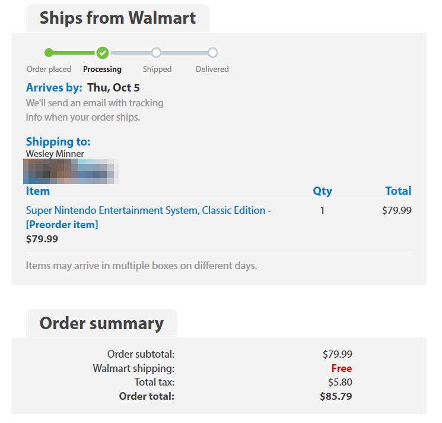

# Documentation

### Overview

Checks online availability of SNES Classic and sends you an email with the applicable store link if in-stock.

Leave this script running to have your own personal SNES Classic availability checker. Only supports gmail right now, but you can easily edit a few lines to make it work with other services.

The script may have a high false positive rate (false alert), since I don't exactly know how the HTML pages will look when the SNESC goes in-stock, but is tuned to ensure zero false negatives (missing the alert when it goes in-stock).

I'll be adding more supported websites as they post their SNESC links, but you can easily add more yourself. Just add the website, its SNESC link, and some HTML code you think is likely to disappear when it goes in-stock.

Currently supported websites:
* [Bestbuy](http://www.bestbuy.com/site/nintendo-entertainment-system-snes-classic-edition/5919830.p?skuId=5919830)
* [Walmart](https://www.walmart.com/ip/PO-HDW-PLACEHOLDER-652-WM50-Universal/55791858)
* [BHPhoto](https://www.bhphotovideo.com/c/product/1347308-REG/nintendo_snes_super_nintendo_classic_edition.html)

Unsupported websites:
* [Amazon](https://www.amazon.com/gp/product/B0721GGGS9): they have a policy of no automated queries, and employ techniques to detect and stop robots from repeated queries. You can still add Amazon back into the `websites` list if you want to try your luck.
* [Target](https://www.target.com/p/snes-classic-edition/-/A-52826093): same problem as Amazon

### Supported Platforms

Runs on anything that can run Python3.

# How to Use

### Dependencies

* [Python3](https://www.python.org/downloads/)

### Install

1. Python3 (for Linux/Mac): `sudo apt-get install python3`
	1. For Windows, just install Python3 from executable from their website
	
### Running

1. Run the script
	1. Enter your SEND email: I use a low security gmail address because I don't want to mess with two-factor auth or app-specific passwords. Your input will be cached/pickled for future runs of the script.
	1. Enter your SEND email password: This is not stored anywhere and you need to enter it each time you run the script.
	1. Enter your RECEIVE email: I use my main, secure email for this, since no password is needed. This will be cached. Note that you can use the same email for both SEND and RECEIVE if you want.

### Usage

```
snes_checker.py [OPTION]...
    -n <max_num_of_alerts>
        limits the max number of alerts
    -s <sleep_time_in_sec>
        changes the sleep time
    -t  test email mode
```

# Results

After running this full time for a few weeks on an old Raspberry Pi 2...

***Success!***




# License
See [here](./LICENSE). I am not using affiliate links or any other form of monitization on this code. I just want to improve my chances at getting a SNES Classic :)